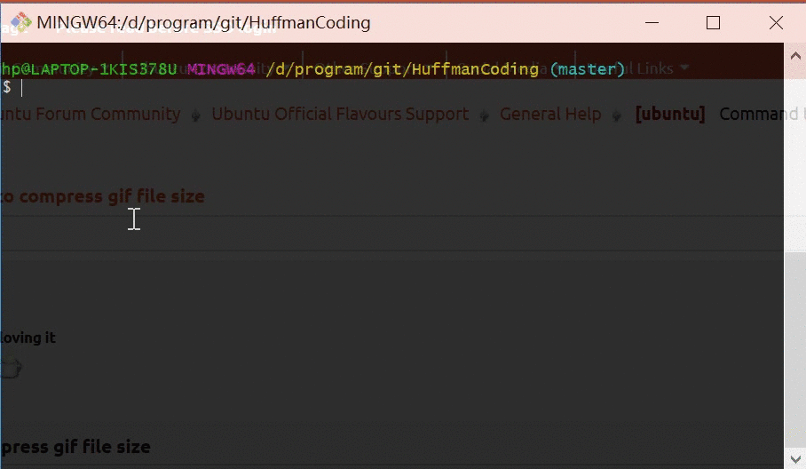

# README

## DEMO

Windows Mingw 运行效果如下：



## 运行说明

如果你有 `gnu make` 环境，可以直接在 `src/` 目录下运行以下命令：

```bash
$ make
```

该命令会对源程序进行编译。然后执行以下命令：

```bash
$ ./main.out
```

该命令会执行编译后的 `c++` 程序。


你也可以把需要测试的构建哈夫曼树的句子写在 `./data/tree_build.txt` 这个文件中，需要测试的 01 写在 `./data/text_dor_decode.txt` 这个文件中。然后在根目录下运行以下命令即可测试：

```bash
$ ./run.sh
```

*PostScript*: 

- 这是一个 bash 脚本；
- 他通过 `interact.py` 这个 `python` 文件，调用 `pwntools` 这个库与生成的 `main` 程序进行交互；
- 通过 `split.awk` 这个 `awk` 文件，将生成的文件划分成不同的文件；
- 结果全部在 `./data/` 这个文件夹当中。
